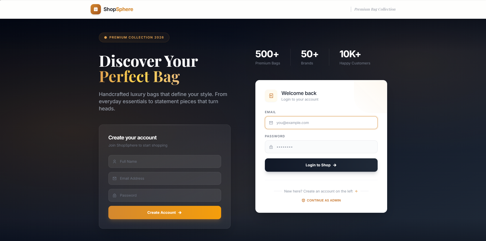
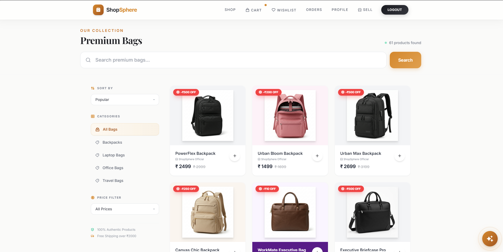
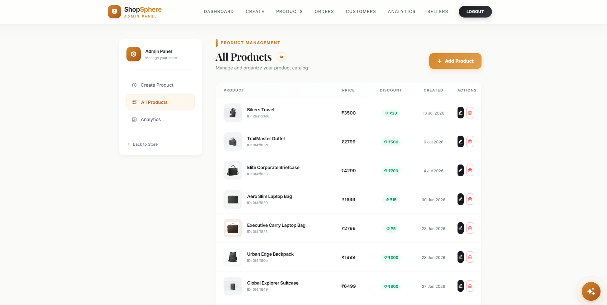
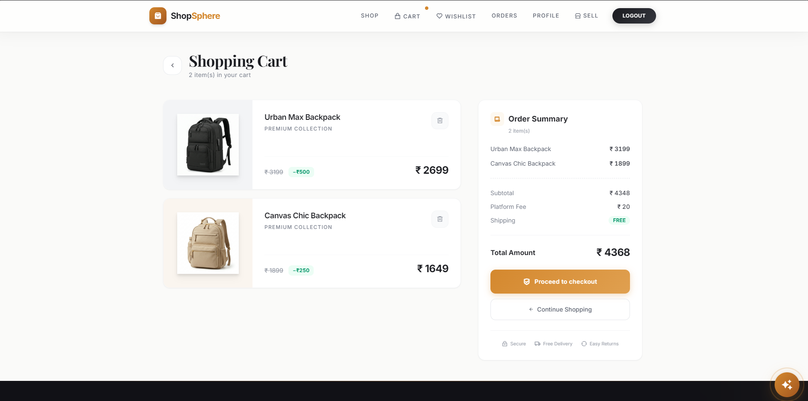
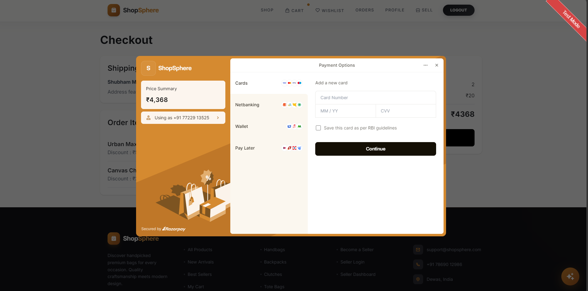
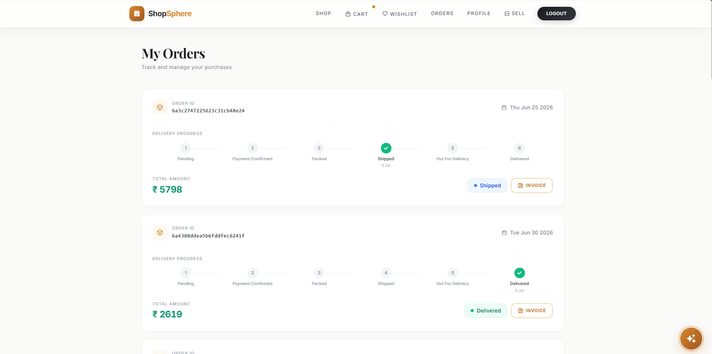
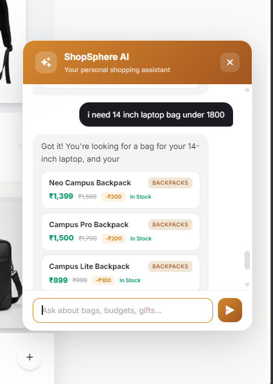
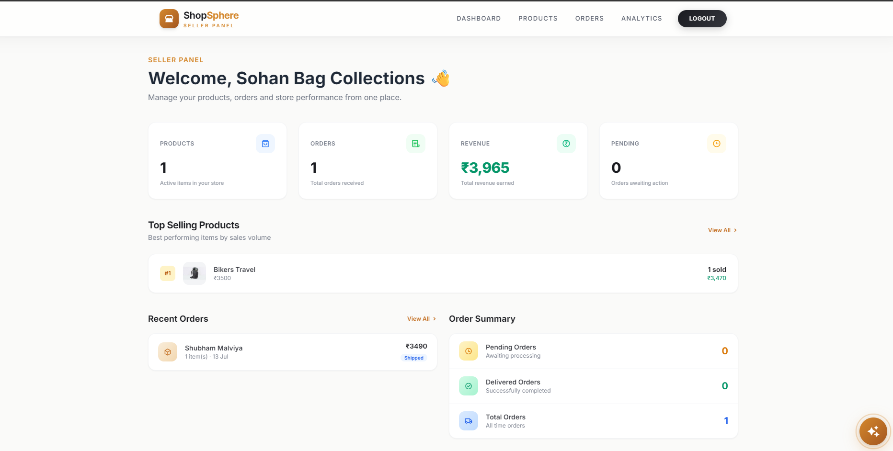
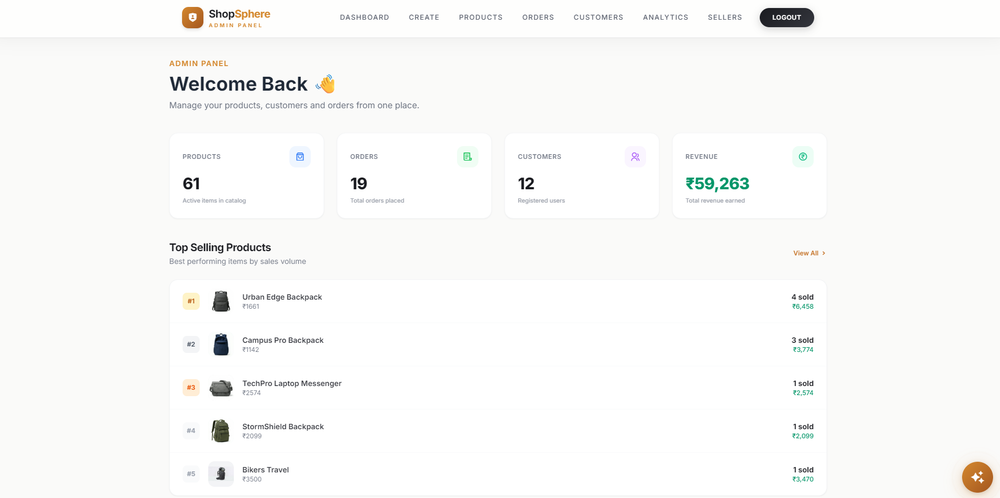
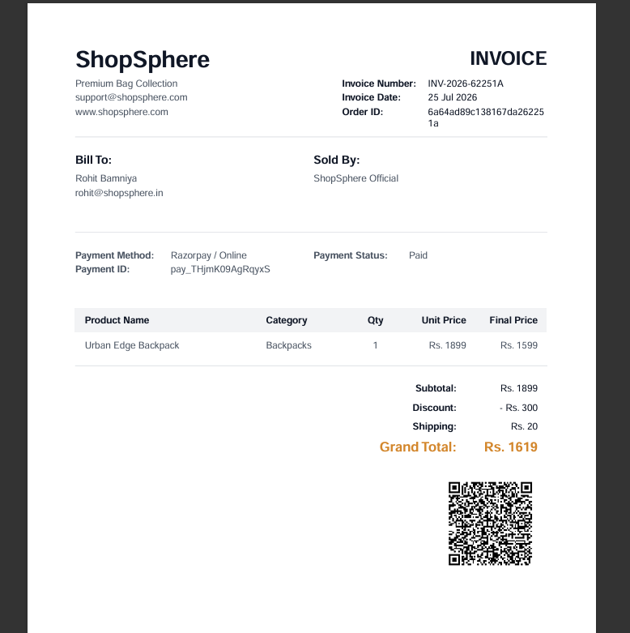

# 🛍️ ShopSphere — AI-Powered Multi-Vendor E-Commerce Platform

<div align="center">


**A production-ready, full-stack multi-vendor e-commerce platform built with Node.js, Express.js, and MongoDB. Features three isolated role systems, HMAC-verified payments, AI-powered product recommendations, and PDF invoice generation.**

[Features](#-features) · [Architecture](#-architecture) · [Tech Stack](#-tech-stack) · [Setup](#-getting-started) · [API Routes](#-api-routes) · [Screenshots](#-screenshots)

</div>

---

## 📌 Project Overview

ShopSphere is a complete multi-vendor e-commerce platform for bag products, where **Customers** shop, **Sellers** manage their own store, and a single **Owner** governs the platform. Every engineering decision in this project is backed by a concrete security or business requirement — not convention.

The idea behind ShopSphere came from a simple observation: students and professionals often struggle to find the right bag according to their requirements, budget, and usage.

ShopSphere is a multi-vendor e-commerce platform that allows customers to discover products, sellers to manage their stores, and administrators to control the marketplace.

Currently, the platform focuses on the Bags category including backpacks, laptop bags, travel bags, and lifestyle bags, while the architecture is designed for future expansion into multiple categories.

> This is not a tutorial clone. Every module was designed, debugged, and verified against the actual source code.

---

## ✨ Features

### 👤 Customer

- Register, login, and browse products
- Search by keyword (regex), filter by category and price range, sort by price or date
- Shopping cart with **server-side bill calculation** (never trusts client-side totals)
- Wishlist with duplicate prevention
- Razorpay payment with **HMAC-SHA256 server-side verification** before order creation
- Order tracking with full status history
- Purchase-gated product reviews and star ratings
- AI-powered product recommendations in **English and Hinglish**
- Downloadable **PDF invoice with embedded QR code**

### 🏪 Seller

- Register and await Owner approval before accessing the dashboard
- Full product CRUD with ownership verification on every operation
- Seller dashboard with **7 real-time metrics** powered by MongoDB Aggregation Pipelines
- Revenue isolated per seller from shared multi-seller orders

### 👑 Owner

- Approve or block seller accounts (takes effect immediately on next request, even mid-session)
- Platform-wide analytics: total products, orders, customers, revenue
- Full product management across all sellers
- Owner account creation locked to development environment with a one-time guard

---

## 🏗️ Architecture

ShopSphere follows **MVC (Model-View-Controller)** architecture:

View Layer:
EJS templates + Tailwind CSS

Controller Layer:
Handles business logic

Model Layer:
Mongoose schemas interacting with MongoDB

```
Browser
  │
  ▼
app.js ── Global Middleware (session, flash, cookies, body-parser, static)
  │
  ▼
Router Layer (7 Routers)
  ├── /          → index.js         [isLoggedIn]       → Customer pages
  ├── /users     → userRouter.js    [public]           → Auth routes
  ├── /sellers   → sellerRouter.js  [isSellerLoggedIn] → Seller dashboard
  ├── /owners    → ownerRouter.js   [isOwnerLoggedIn]  → Owner panel
  ├── /products  → productsRouter.js[isOwnerLoggedIn]  → Product management
  ├── /payment   → paymentRouter.js [isLoggedIn]       → Payment flow
  └── /ai        → aiRouter.js      [isLoggedIn]       → AI chat
  │
  ▼
Controller Layer (Business Logic)
  ├── authController.js
  ├── paymentController.js
  └── aiController.js
  │
  ├──▶ MongoDB (6 Collections: users, sellers, owners, products, orders, reviews)
  ├──▶ Razorpay API
  └──▶ Google Gemini API
  │
  ▼
EJS Template Engine → Complete HTML → Browser
```

---

## 🔐 Security Decisions (What Makes This Different)

| Problem                                     | My Solution                                                               | Where in Code                                                |
| ------------------------------------------- | ------------------------------------------------------------------------- | ------------------------------------------------------------ |
| Role leakage across user types              | 3 separate collections, cookies, and middleware — zero overlap            | `isLoggedIn.js`, `isSellerLoggedIn.js`, `isOwnerLoggedIn.js` |
| Browser payment results can be faked        | HMAC-SHA256 verification on server before order creation                  | `paymentController.js` — `crypto.createHmac`                 |
| Invoice prices change after seller edits    | `purchasedItems[]` snapshot captures price at checkout, never overwritten | `order-model.js`                                             |
| AI recommends products not in stock         | MongoDB queried before Gemini API call — AI only sees real inventory      | `aiController.js` — `extractIntent()`                        |
| Blocked seller stays logged in              | Middleware re-checks `isBlocked` + `isApproved` on every request          | `isSellerLoggedIn.js` line 20                                |
| Stock over-sells during concurrent checkout | Stock validated at add-to-cart AND at checkout separately                 | `index.js` lines 115, 188–193                                |
| Duplicate reviews                           | Compound unique index `{product, user}` enforced at database level        | `review-model.js`                                            |

---

## 🗄️ Database Design

**6 MongoDB Collections** connected via Mongoose ObjectId references:

```
users          sellers         owners
  │               │               │
  │               │               │
  └──────────────▼───────────────┘
               products
                  │
         ┌────────┴────────┐
         ▼                 ▼
       orders           reviews
  (purchasedItems[])
  (statusHistory[])
```

| Collection   | Key Design Decision                                                           |
| ------------ | ----------------------------------------------------------------------------- |
| **users**    | `cart[]`, `wishlist[]`, `orders[]` — ObjectId arrays, populated on demand     |
| **sellers**  | `isApproved` + `isBlocked` — double-gated on login AND every middleware call  |
| **owners**   | Single owner enforced in code — creation blocked if any owner exists in DB    |
| **products** | Images stored as Base64 Data URLs — no file system dependency                 |
| **orders**   | `purchasedItems[]` snapshot — price frozen at checkout time forever           |
| **reviews**  | Unique compound index `{product, user}` — one review per customer per product |

---

## 💳 Razorpay Payment Flow

```
Customer clicks Pay
       │
       ▼
Server creates Razorpay order (amount × 100 paise)
       │
       ▼
Browser opens Razorpay popup
       │
       ▼
Customer completes payment
       │
       ▼
Browser sends { order_id, payment_id, signature }
       │
       ▼
Server: HMAC-SHA256 verification
       │
   ┌───┴───┐
   ▼       ▼
PASS      FAIL
   │       │
   ▼       ▼
Create   HTTP 400
Order    No order created
```

---

## 🤖 AI Recommendation Engine

The AI system uses a **database-first approach** to prevent hallucinations:

1. User sends query in English or Hinglish
2. `extractIntent()` parses category + price budget using regex
3. MongoDB queries matching **in-stock** products only
4. Real product data injected into Gemini prompt context
5. Gemini (`gemini-2.5-flash`) responds — only recommending real items
6. Auto-detects language via `SYSTEM_PROMPT` — replies in English or Hinglish

---

## 📦 Tech Stack

| Technology            | Version | Role                            |
| --------------------- | ------- | ------------------------------- |
| Node.js               | —       | Backend runtime                 |
| Express.js            | ^4.21.0 | Web framework, routing          |
| MongoDB               | —       | NoSQL database                  |
| Mongoose              | ^9.7.0  | Schema definitions, queries     |
| EJS                   | ^3.1.10 | Server-side HTML rendering      |
| jsonwebtoken          | ^9.0.3  | JWT generation and verification |
| bcrypt                | ^6.0.0  | Password hashing                |
| cookie-parser         | ^1.4.7  | JWT cookie management           |
| express-session       | ^1.19.0 | Session handling                |
| connect-flash         | ^0.1.1  | Flash messages                  |
| Multer                | ^2.2.0  | File upload (memory storage)    |
| Razorpay              | ^2.9.6  | Payment gateway                 |
| @google/generative-ai | ^0.24.1 | Gemini AI SDK                   |
| PDFKit                | ^0.19.1 | PDF invoice generation          |
| qrcode                | ^1.5.4  | QR code for invoices            |
| dotenv                | ^17.4.2 | Environment variable management |

---

## 📁 Folder Structure

```
ShopSphere/
├── app.js                     # Entry point — mounts all 7 routers
├── .env                       # Secrets (excluded from Git)
├── config/
│   ├── mongoose-connection.js # MongoDB connection
│   ├── razorpay.config.js     # Razorpay SDK instance
│   └── multer-config.js       # Multer memory storage
├── models/
│   ├── user-model.js
│   ├── seller-model.js
│   ├── owner-model.js
│   ├── product-model.js
│   ├── order-model.js
│   └── review-model.js
├── routes/
│   ├── index.js               # Customer routes
│   ├── userRouter.js
│   ├── sellerRouter.js
│   ├── ownerRouter.js
│   ├── productsRouter.js
│   ├── paymentRouter.js
│   └── aiRouter.js
├── controllers/
│   ├── authController.js
│   ├── paymentController.js
│   └── aiController.js
├── middlewares/
│   ├── isLoggedIn.js
│   ├── isSellerLoggedIn.js
│   └── isOwnerLoggedIn.js
├── utils/
│   ├── generateToken.js
│   └── generateInvoice.js     # PDFKit + QR code (237 lines)
├── views/                     # EJS templates
│   ├── shop.ejs
│   ├── cart.ejs
│   ├── orders.ejs
│   ├── wishlist.ejs
│   ├── product-details.ejs
│   ├── seller-dashboard.ejs
│   ├── seller-store.ejs
│   ├── createproducts.ejs
│   └── partials/
└── public/                    # Static CSS and assets
```

---

## 🚀 Getting Started

### Prerequisites

- Node.js (v18+ recommended)
- MongoDB (local or MongoDB Atlas)
- Razorpay account (test mode keys)
- Google AI Studio API key (Gemini)

### Installation

```bash
# 1. Clone the repository
git clone https://github.com/rohitbamniya4141/Shopsphere-full-stack-web.git
cd Shopsphere-full-stack-web

# 2. Install dependencies
npm install

# 3. Create a .env file
touch .env
```

### Environment Variables

Create a `.env` file in the root directory with the following:

```env
# MongoDB
MONGODB_URI=mongodb://localhost:27017/shopsphere

# JWT Secrets
JWT_SECRET=**************
SELLER_JWT_SECRET=**************
OWNER_JWT_SECRET=**************

# Session Secret
SESSION_SECRET=**************

# Razorpay
RAZORPAY_KEY_ID=**************
RAZORPAY_KEY_SECRET=**************

# Google Gemini AI
GEMINI_API_KEY=**************

# Environment
NODE_ENV=development
```

### Run the Application

```bash
# Development mode
npm start

# The app runs at http://localhost:3000
```

### First-Time Setup

1. With `NODE_ENV=development`, visit `http://localhost:3000/owners/register` to create the Owner account
2. The Owner can then approve Sellers from the admin dashboard
3. Sellers can list products once approved
4. Customers can browse, add to cart, and purchase

---

## 🗺️ API Routes

### Customer Routes (`/`)

| Method | Route                 | Description                               |
| ------ | --------------------- | ----------------------------------------- |
| GET    | /shop                 | Product catalog with search, filter, sort |
| GET    | /cart                 | View shopping cart                        |
| POST   | /add-to-cart/:id      | Add product to cart                       |
| DELETE | /remove-from-cart/:id | Remove from cart                          |
| GET    | /wishlist             | View wishlist                             |
| POST   | /add-to-wishlist/:id  | Add to wishlist                           |
| GET    | /orders               | View all orders                           |
| POST   | /orders/:id/cancel    | Cancel order                              |
| GET    | /orders/:id/invoice   | Download PDF invoice                      |
| POST   | /product/:id/review   | Submit a review                           |

### Auth Routes (`/users`)

| Method | Route           | Description          |
| ------ | --------------- | -------------------- |
| GET    | /users/login    | Login page           |
| POST   | /users/login    | Process login        |
| GET    | /users/register | Register page        |
| POST   | /users/register | Process registration |
| GET    | /users/logout   | Logout               |

### Seller Routes (`/sellers`)

| Method | Route                    | Description           |
| ------ | ------------------------ | --------------------- |
| GET    | /sellers/dashboard       | Analytics dashboard   |
| GET    | /sellers/products        | Seller's product list |
| POST   | /sellers/products/create | Create new product    |
| PUT    | /sellers/products/:id    | Edit product          |
| DELETE | /sellers/products/:id    | Delete product        |

### Owner Routes (`/owners`)

| Method | Route                       | Description             |
| ------ | --------------------------- | ----------------------- |
| GET    | /owners/dashboard           | Platform analytics      |
| GET    | /owners/admin               | Seller management panel |
| POST   | /owners/sellers/:id/approve | Approve seller          |
| POST   | /owners/sellers/:id/block   | Block seller            |

### Payment Routes (`/payment`)

| Method | Route                   | Description                  |
| ------ | ----------------------- | ---------------------------- |
| POST   | /payment/create-order   | Create Razorpay order        |
| POST   | /payment/verify-payment | HMAC verify and record order |

### AI Routes (`/ai`)

| Method | Route    | Description        |
| ------ | -------- | ------------------ |
| POST   | /ai/chat | Send message to AI |

---

## 📸 Screenshots

### 👤 Customer Experience

#### Customer Login



#### Product Catalog



#### Product Details



#### Shopping Cart



#### Razorpay Payment



#### Orders Page



### 🤖 AI Shopping Assistant



### 🏪 Seller Panel

#### Seller Dashboard



### 👑 Owner Panel

#### Owner Dashboard



### 📄 Invoice Generation



_Screenshots available in the `/screenshots` folder._

---

## 🧪 Key Test Scenarios

| Scenario                            | Expected Result                                      |
| ----------------------------------- | ---------------------------------------------------- |
| Login with blocked seller account   | Cookie cleared, flash error — immediate block        |
| Tampered Razorpay payment signature | HTTP 400, order NOT created                          |
| Add out-of-stock item to cart       | Flash error, redirect to shop                        |
| Cancel a "Packed" order             | Flash error, cancellation blocked                    |
| Submit review without purchasing    | Flash error, submission blocked                      |
| Duplicate wishlist entry            | Second click silently ignored                        |
| AI query in Hinglish                | Replies in Hinglish with real in-stock products only |

---

## 🎯 What I Learned Building This

- **MongoDB Aggregation Pipelines** — `$unwind → $match → $group` for per-seller revenue isolation
- **Cryptographic payment verification** — HMAC-SHA256 using Node.js `crypto` module
- **Role isolation without a shared auth system** — three completely separate collections, cookies, and middleware guards
- **Database-first AI prompting** — preventing LLM hallucination by injecting real inventory into the prompt context
- **Immutable order records** — `purchasedItems[]` snapshot pattern to decouple invoice accuracy from live data
- **Memory-based file uploads** — Multer `memoryStorage` → Base64 pipeline with zero disk dependency

---

## 📄 License

This project is open source and available under the [MIT License](LICENSE).

---

## 👨‍💻 Author

**Rohit Bamniya**

- GitHub: [@your-username](https://github.com/rohitbamniya4141)
- LinkedIn: [your-linkedin](https://www.linkedin.com/in/rohit-bamniya-mcanitt)
- Email: rohitbamniya.nitt@gmail.com

---

## 🚀 Future Improvements

- Cloud-based image storage using AWS S3/Cloudinary
- Product recommendation improvements using embeddings
- Payment webhook integration
- Advanced search using Elasticsearch
- Mobile application support

---

<div align="center">

⭐ **If you found this project useful, please give it a star!** ⭐

_Built with genuine engineering decisions, not just tutorial code._

</div>
